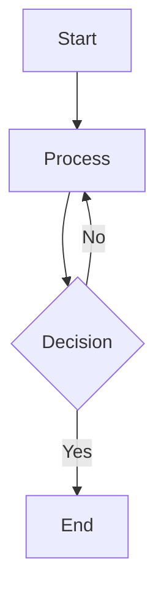

# Quilldown


A lightweight, native macOS markdown viewer and editor built with SwiftUI and WebKit. Write, preview, and export markdown with support for math equations, diagrams, and syntax highlighting—all without external dependencies.

## Features

- **Multiple View Modes**: Editor-only, preview-only, or split view with synchronized scrolling
- **Math Equations**: Full support for LaTeX via KaTeX with both inline (`$...$`) and display (`$$...$$`, `\(...\)`, `\[...\]`) syntax
- **Diagrams**: Create flowcharts, sequence diagrams, class diagrams, and more with Mermaid
- **Syntax Highlighting**: Code blocks with 18+ language support via Prism.js
- **Table of Contents**: Auto-generated sidebar with clickable navigation to headings
- **PDF Export**: Export rendered markdown as PDF with Cmd+Shift+E
- **Live File Watching**: External file edits automatically refresh in the app (compatible with vim, emacs, and other editors)
- **Dark Mode**: Full support for macOS dark mode with automatic detection
- **Zoom**: Adjustable zoom from 50% to 300%
- **No External Dependencies**: All rendering libraries are bundled—no internet connection or package manager required

## System Requirements

- macOS 14.0 (Sonoma) or later
- Apple Silicon or Intel Mac

## Installation

### Homebrew

```bash
brew tap ysys143/tap
brew install --cask quilldown
```

### Direct Download

Download the latest DMG from [GitHub Releases](https://github.com/ysys143/quilldown/releases) and drag Quilldown to Applications.

### Build from Source

**Requirements:**
- Xcode 16.0 or later
- XcodeGen

**Steps:**

```bash
# Clone the repository
git clone https://github.com/ysys143/quilldown.git
cd quilldown

# Generate Xcode project
xcodegen generate

# Build and create DMG
./scripts/create-dmg.sh
```

The built app will be available as `Quilldown.dmg`.

## Usage

### Opening Files

Open Quilldown and create a new markdown file, or drag and drop any .md, .markdown, .mdown, or .mkd file onto the app.

### View Modes

Switch between three view modes using the toolbar buttons or keyboard shortcuts:

| Mode | Keyboard Shortcut | Description |
|------|-------------------|-------------|
| Editor | Cmd+1 | Edit markdown source with syntax highlighting |
| Preview | Cmd+3 | View rendered markdown |
| Split | Cmd+2 | Edit and preview side-by-side with synchronized scrolling |

### Keyboard Shortcuts

| Action | Shortcut |
|--------|----------|
| Editor mode | Cmd+1 |
| Split view | Cmd+2 |
| Preview mode | Cmd+3 |
| Toggle sidebar | Cmd+B |
| Zoom in | Cmd++ |
| Zoom out | Cmd+- |
| Actual size | Cmd+0 |
| Reload document | Cmd+R |
| Export as PDF | Cmd+Shift+E |

### Writing Markdown

Quilldown supports standard markdown syntax plus extended features:

**Math Equations:**

Inline: $E = mc^2$ / Display:

$$\int_0^\infty e^{-x^2} dx = \frac{\sqrt{\pi}}{2}$$

**Diagrams (Mermaid):**



**Code Blocks with Syntax Highlighting:**

```swift
let greeting = "Hello, Quilldown!"
print(greeting)
```

Supports 18+ languages including Swift, Python, JavaScript, Go, Rust, TypeScript, and more.

### Sidebar Navigation

The table of contents sidebar automatically generates from your document's headings. Click any heading to jump to that section. Toggle the sidebar with Cmd+B or the toolbar button.

### External File Watching

When you open a markdown file, Quilldown watches for changes. If the file is modified by an external editor (vim, VS Code, etc.), the app automatically refreshes the content. Perfect for syncing edits across multiple tools.

### PDF Export

Export your rendered markdown as a PDF:
1. Open a markdown file
2. Press Cmd+Shift+E (or menu: File > Export as PDF...)
3. Choose save location and filename

The exported PDF includes all rendered math, diagrams, and formatted code.

## Supported File Types

- `.md` - Standard markdown
- `.markdown` - Markdown variant
- `.mdown` - Markdown variant
- `.mkd` - Markdown variant

## Technology Stack

- **Language**: Swift 5.9
- **UI Framework**: SwiftUI
- **Web Rendering**: WebKit (WKWebView)
- **Markdown Parser**: markdown-it
- **Math Rendering**: KaTeX
- **Syntax Highlighting**: Prism.js
- **Diagrams**: Mermaid

## Performance

- **App Size**: ~4.1 MB
- **DMG Size**: ~1.7 MB
- Minimal memory footprint with fast markdown rendering

## Architecture

Quilldown uses a modular architecture with clear separation of concerns:

- **ContentView**: Main layout managing view modes and sidebar
- **MarkdownEditorView**: Native text editor with line numbers
- **MarkdownWebView**: WebKit-based renderer with embedded rendering libraries
- **MarkdownDocument**: Document management and undo/redo support
- **FileWatcher**: Monitors external file changes and reloads content
- **SyncCoordinator**: Keeps editor and preview scrolling synchronized
- **TOCSidebarView**: Table of contents navigation

All rendering happens locally in an embedded HTML/JavaScript environment with no external dependencies.

## Privacy

Quilldown does not collect any data and does not require internet connectivity. All rendering happens locally on your machine.

## Contributing

Contributions are welcome. Please feel free to submit pull requests or open issues for bugs and feature requests.

## Troubleshooting

**Q: The app won't open PDFs**
A: Quilldown is a markdown-focused editor, not a general document viewer. Use Preview or another PDF reader for PDF files.

**Q: Diagram/math rendering not working**
A: Ensure you're using the correct syntax. Check that markdown blocks are properly formatted with triple backticks for code and correct LaTeX delimiters for math.

**Q: External file changes not detected**
A: File watching works best with standard file write operations. Some editors with unusual save mechanisms may not trigger updates. Use Cmd+R to manually reload.

**Q: Can I use Quilldown in a terminal-only environment?**
A: No, Quilldown is a native macOS GUI application and requires a graphical display.

## Development

### Project Structure

```
Quilldown/
├── *.swift              # Core application files
├── Resources/           # Web assets (HTML, CSS, JavaScript)
├── Assets.xcassets/     # App icons and images
└── Info.plist          # App metadata
```

### Building for Distribution

To create a signed and notarized build for distribution:

```bash
./scripts/create-dmg.sh
codesign --sign 'Developer ID Application: Your Name' Quilldown.dmg
xcrun notarytool submit Quilldown.dmg --keychain-profile 'profile' --wait
xcrun stapler staple Quilldown.dmg
```

## License

Apache License 2.0. See [LICENSE](LICENSE) for details.
