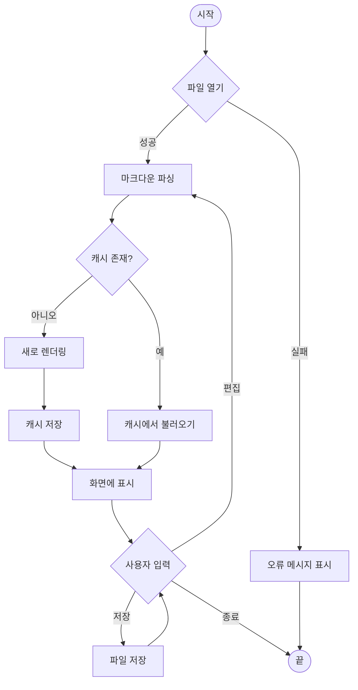
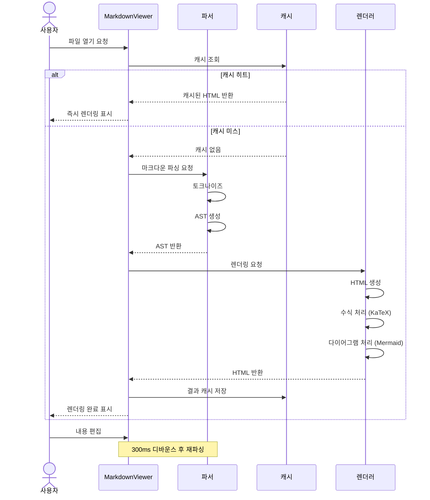
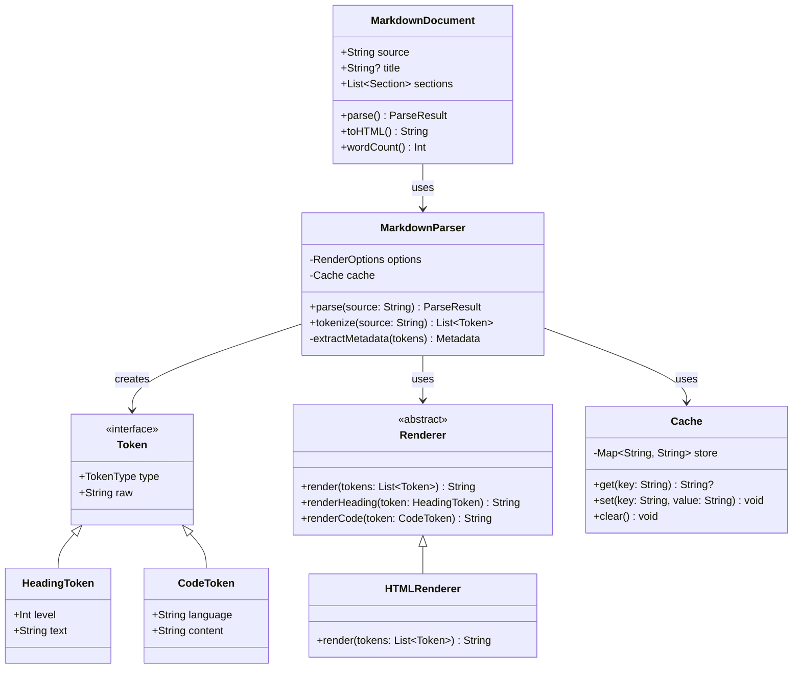
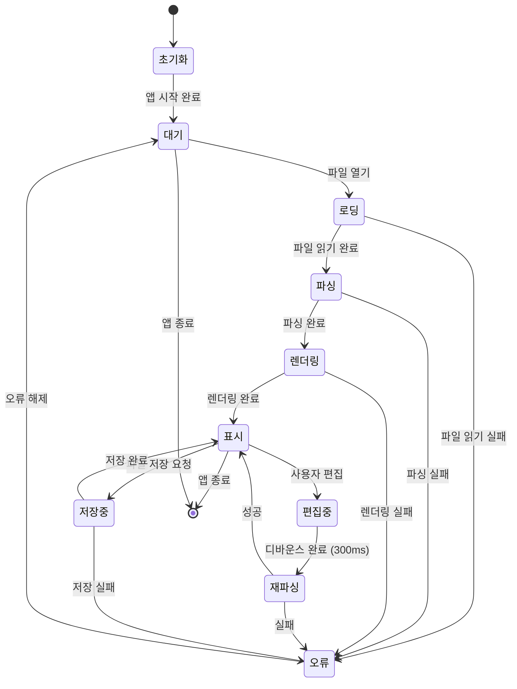
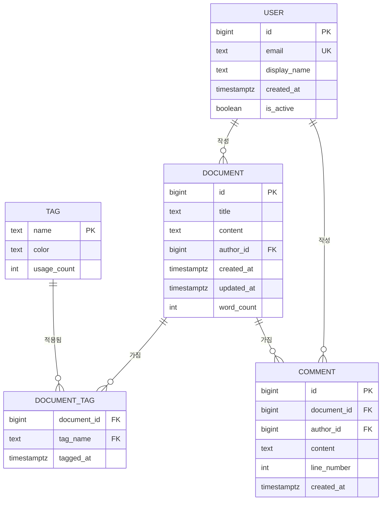
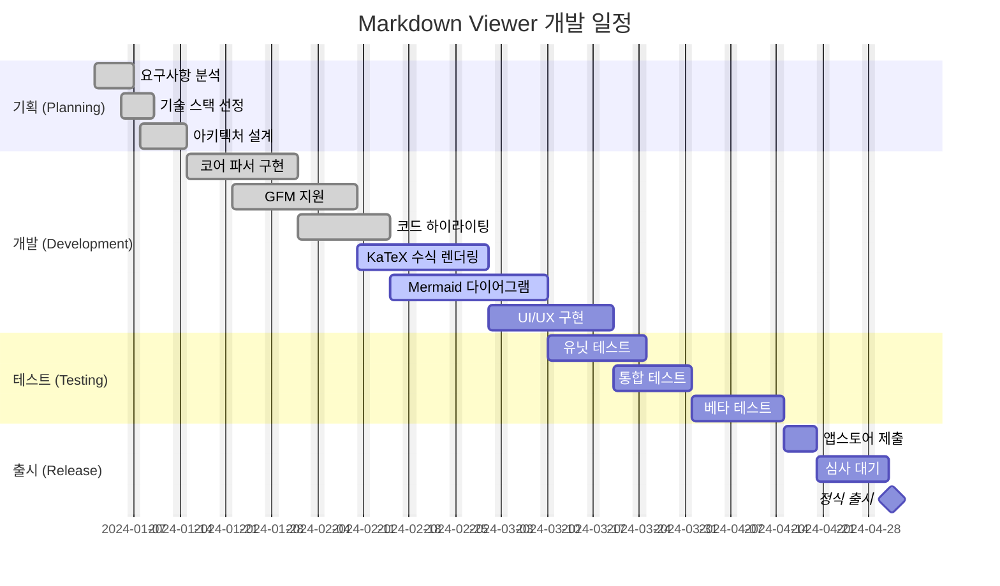
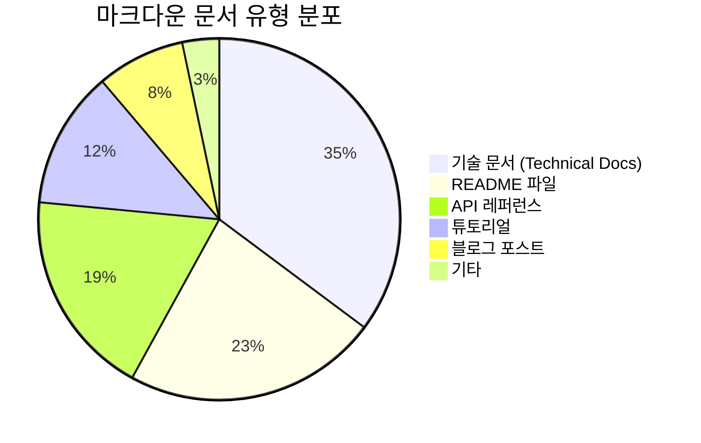

# Markdown Viewer 종합 테스트 문서

> **목적:** 이 문서는 Markdown Viewer 앱의 모든 렌더링 기능을 검증하기 위한 종합 테스트 픽스처입니다.
> This document is a comprehensive test fixture for validating all rendering features of the Markdown Viewer app.

---

## Table of Contents

- [Headings](#headings)
- [Text Formatting](#text-formatting)
- [Lists](#lists)
- [Links and Images](#links-and-images)
- [Blockquotes](#blockquotes)
- [Tables](#tables)
- [Code Blocks](#code-blocks)
- [Math / LaTeX](#math--latex)
- [Mermaid Diagrams](#mermaid-diagrams)
- [Edge Cases](#edge-cases)
- [Footnotes](#footnotes)

---

# 1. Headings (제목)

# H1 — 최상위 제목 (Document Title Level)
## H2 — 섹션 제목 (Section Level)
### H3 — 소섹션 제목 (Subsection Level)
#### H4 — 세부 제목 (Detail Level)
##### H5 — 미세 제목 (Minor Level)
###### H6 — 최소 제목 (Smallest Level)

---

# 2. Text Formatting (텍스트 서식)

이 섹션은 다양한 인라인 텍스트 서식을 테스트합니다.
This section tests various inline text formatting options.

**굵게 (Bold)** — `**double asterisk**`

_이탤릭 (Italic)_ — `_underscore_`

*이탤릭 (Italic alt)* — `*single asterisk*`

***굵은 이탤릭 (Bold + Italic)*** — `***triple asterisk***`

~~취소선 (Strikethrough)~~ — `~~double tilde~~`

`인라인 코드 (Inline Code)` — backtick

**_중첩 서식:_** ***bold italic*** 그리고 `코드 in bold context`

Combining: ~~**굵은 취소선**~~ and ***~~기울임 취소선~~***

---

# 3. Lists (목록)

## 3.1 Unordered Lists (순서 없는 목록)

- 사과 (Apple)
- 바나나 (Banana)
  - 카벤디시 (Cavendish)
  - 플랜틴 (Plantain)
    - 익힌 플랜틴
    - 날 플랜틴
- 체리 (Cherry)
  - 달콤한 체리
  - 신 체리

## 3.2 Ordered Lists (순서 있는 목록)

1. 첫 번째 단계: 계획 수립
2. 두 번째 단계: 설계
   1. 아키텍처 설계
   2. UI/UX 설계
      1. 와이어프레임
      2. 프로토타입
3. 세 번째 단계: 구현
4. 네 번째 단계: 테스트
5. 다섯 번째 단계: 배포

## 3.3 Task Lists (체크박스 목록)

### 프로젝트 체크리스트

- [x] 프로젝트 초기화 (Project initialization)
- [x] 요구사항 정의 (Requirements definition)
- [x] 아키텍처 설계 (Architecture design)
- [ ] 코어 기능 구현 (Core feature implementation)
- [ ] 유닛 테스트 작성 (Unit test writing)
- [ ] UI 구현 (UI implementation)
  - [x] 기본 레이아웃 (Basic layout)
  - [x] 네비게이션 (Navigation)
  - [ ] 다크 모드 지원 (Dark mode support)
  - [ ] 접근성 개선 (Accessibility improvements)
- [ ] 코드 리뷰 (Code review)
- [ ] 베타 테스트 (Beta testing)
- [ ] 앱스토어 제출 (App Store submission)

---

# 4. Links and Images (링크 및 이미지)

## 4.1 Inline Links (인라인 링크)

[Apple Developer Documentation](https://developer.apple.com/documentation/)

[GitHub](https://github.com "GitHub — Where the world builds software")

[Korean Wikipedia](https://ko.wikipedia.org)

## 4.2 Reference Style Links (참조 스타일 링크)

This is a paragraph with a [reference link][ref1] and another [reference link with title][ref2].

See also the [Swift Evolution proposals][swift-evolution] for language changes.

[ref1]: https://www.example.com
[ref2]: https://www.example.org "Example Organization"
[swift-evolution]: https://github.com/swiftlang/swift-evolution

## 4.3 Autolinks (자동 링크)

Visit https://www.apple.com for more information.

Send email to: <noreply@example.com>

Raw URL (GFM autolink): https://swift.org/getting-started/

## 4.4 Images (이미지)


Reference-style image: ![Reference Image][logo]

[logo]: https://placehold.co/200x200/34C759/FFFFFF?text=Logo

---

# 5. Blockquotes (인용문)

## 5.1 Simple Blockquote

> 단순한 인용문입니다. This is a simple blockquote.
> It can span multiple lines and remains part of the same quote block.

## 5.2 Nested Blockquotes (중첩 인용문)

> 첫 번째 레벨 인용문
>
> > 두 번째 레벨 인용문 (중첩)
> >
> > > 세 번째 레벨 인용문 (삼중 중첩)
> > >
> > > 깊은 인용은 문서에서 토론 스레드를 나타낼 때 사용됩니다.
> >
> > 두 번째 레벨로 돌아옴
>
> 첫 번째 레벨로 돌아옴

## 5.3 Blockquote with Formatting

> **중요 알림:** 이 앱은 GitHub Flavored Markdown을 완벽하게 지원합니다.
>
> 지원하는 기능 목록:
> - 코드 하이라이팅
> - 수식 렌더링 (KaTeX)
> - 다이어그램 (Mermaid)
>
> `inline code` 도 인용문 안에서 잘 작동합니다.

---

# 6. Horizontal Rules (수평선)

세 가지 방식 모두 동일하게 렌더링되어야 합니다:

Using hyphens:

---

Using asterisks:

***

Using underscores:

___

---

# 7. Tables (테이블)

## 7.1 Basic Table with Alignment

| 언어 (Language) | 패러다임 (Paradigm) | 타입 시스템 (Type System) | 첫 출시 (First Release) |
|:----------------|:-------------------:|:-------------------------:|------------------------:|
| Swift           | Multi-paradigm      | Static, Strong            | 2014                    |
| Python          | Multi-paradigm      | Dynamic, Strong           | 1991                    |
| Rust            | Systems             | Static, Strong            | 2015                    |
| Go              | Concurrent          | Static, Strong            | 2009                    |
| JavaScript      | Multi-paradigm      | Dynamic, Weak             | 1995                    |
| TypeScript      | Multi-paradigm      | Static (optional)         | 2012                    |
| Haskell         | Functional          | Static, Strong            | 1990                    |
| C               | Procedural          | Static, Weak              | 1972                    |

## 7.2 Table with Inline Formatting

| 기능 (Feature)            | 상태 (Status)  | 비고 (Notes)                         |
|---------------------------|:--------------:|--------------------------------------|
| **GFM Rendering**         | [DONE]         | 모든 GFM 기능 지원                   |
| **Syntax Highlighting**   | [DONE]         | 14+ 언어 지원                        |
| **KaTeX Math**            | [IN PROGRESS]  | 블록 및 인라인 수식                  |
| **Mermaid Diagrams**      | [IN PROGRESS]  | 6가지 다이어그램 유형                |
| ~~레거시 기능~~           | [REMOVED]      | ~~더 이상 지원하지 않음~~            |
| `Dark Mode`               | [DONE]         | 시스템 설정 연동                     |

## 7.3 Narrow Table

| # | 항목 |
|---|------|
| 1 | 가   |
| 2 | 나   |
| 3 | 다   |

---

# 8. Code Blocks (코드 블록)

## 8.1 Swift — SwiftUI Example

```swift
import SwiftUI
import Combine

// MARK: - ViewModel
@MainActor
final class MarkdownViewModel: ObservableObject {
    @Published var content: String = ""
    @Published var isLoading: Bool = false
    @Published var error: Error?

    private var cancellables = Set<AnyCancellable>()
    private let parser: MarkdownParser

    init(parser: MarkdownParser = .shared) {
        self.parser = parser
        setupBindings()
    }

    private func setupBindings() {
        $content
            .debounce(for: .milliseconds(300), scheduler: RunLoop.main)
            .sink { [weak self] text in
                self?.parse(text)
            }
            .store(in: &cancellables)
    }

    func parse(_ text: String) {
        isLoading = true
        Task {
            do {
                let result = try await parser.parse(text)
                self.content = result
            } catch {
                self.error = error
            }
            isLoading = false
        }
    }
}

// MARK: - View
struct MarkdownEditorView: View {
    @StateObject private var viewModel = MarkdownViewModel()
    @Environment(\.colorScheme) private var colorScheme

    var body: some View {
        NavigationSplitView {
            editorPanel
        } detail: {
            previewPanel
        }
        .navigationTitle("Markdown Viewer")
    }

    private var editorPanel: some View {
        TextEditor(text: $viewModel.content)
            .font(.system(.body, design: .monospaced))
            .padding()
    }

    private var previewPanel: some View {
        Group {
            if viewModel.isLoading {
                ProgressView("렌더링 중...")
            } else {
                ScrollView {
                    MarkdownPreview(content: viewModel.content)
                        .padding()
                }
            }
        }
    }
}

#Preview {
    MarkdownEditorView()
}
```

## 8.2 Python — Class with Type Hints

```python
from __future__ import annotations
from dataclasses import dataclass, field
from typing import Optional, Generator
from pathlib import Path
import re


@dataclass
class MarkdownDocument:
    """마크다운 문서를 파싱하고 분석하는 클래스."""

    source: str
    title: Optional[str] = field(default=None, init=False)
    sections: list[str] = field(default_factory=list, init=False)

    def __post_init__(self) -> None:
        self.title = self._extract_title()
        self.sections = list(self._extract_sections())

    def _extract_title(self) -> Optional[str]:
        """첫 번째 H1 헤딩을 문서 제목으로 추출합니다."""
        match = re.search(r'^# (.+)$', self.source, re.MULTILINE)
        return match.group(1) if match else None

    def _extract_sections(self) -> Generator[str, None, None]:
        """모든 헤딩 텍스트를 순서대로 추출합니다."""
        pattern = re.compile(r'^#{1,6} (.+)$', re.MULTILINE)
        yield from (m.group(1) for m in pattern.finditer(self.source))

    @classmethod
    def from_file(cls, path: Path) -> MarkdownDocument:
        """파일에서 마크다운 문서를 로드합니다."""
        return cls(source=path.read_text(encoding='utf-8'))

    def word_count(self) -> int:
        """마크다운 마크업을 제외한 단어 수를 반환합니다."""
        plain = re.sub(r'[#*_`~\[\]()>]', '', self.source)
        return len(plain.split())

    def __repr__(self) -> str:
        return f"MarkdownDocument(title={self.title!r}, sections={len(self.sections)})"


if __name__ == '__main__':
    doc = MarkdownDocument.from_file(Path('test_full.md'))
    print(f"제목: {doc.title}")
    print(f"섹션 수: {len(doc.sections)}")
    print(f"단어 수: {doc.word_count():,}")
```

## 8.3 JavaScript — Async/Await with Error Handling

```javascript
/**
 * Markdown 파일을 비동기로 가져와 렌더링합니다.
 * Fetches and renders a Markdown file asynchronously.
 */
async function renderMarkdownFromUrl(url, targetElement) {
  const controller = new AbortController();
  const timeoutId = setTimeout(() => controller.abort(), 5000);

  try {
    const response = await fetch(url, {
      signal: controller.signal,
      headers: { 'Accept': 'text/plain, text/markdown' },
    });

    if (!response.ok) {
      throw new Error(`HTTP error! status: ${response.status}`);
    }

    const markdown = await response.text();
    const rendered = await parseMarkdown(markdown);

    targetElement.innerHTML = rendered;
    targetElement.querySelectorAll('pre code').forEach(block => {
      hljs.highlightElement(block);
    });

    return { success: true, wordCount: markdown.split(/\s+/).length };
  } catch (error) {
    if (error.name === 'AbortError') {
      console.error('요청 타임아웃: 5초를 초과했습니다.');
    } else {
      console.error('렌더링 실패:', error.message);
    }
    targetElement.textContent = `오류: ${error.message}`;
    return { success: false, error: error.message };
  } finally {
    clearTimeout(timeoutId);
  }
}

// 이벤트 리스너 등록
document.addEventListener('DOMContentLoaded', () => {
  const preview = document.getElementById('preview');
  renderMarkdownFromUrl('/api/document', preview)
    .then(({ success, wordCount }) => {
      if (success) console.log(`렌더링 완료: ${wordCount} 단어`);
    });
});
```

## 8.4 TypeScript — Interfaces and Generics

```typescript
// 마크다운 파서 인터페이스 및 타입 정의
interface MarkdownToken {
  type: 'heading' | 'paragraph' | 'code' | 'math' | 'diagram' | 'list';
  raw: string;
  depth?: number;
  lang?: string;
}

interface ParseResult<T extends MarkdownToken = MarkdownToken> {
  tokens: T[];
  metadata: DocumentMetadata;
  renderTime: number;
}

interface DocumentMetadata {
  title: string | null;
  wordCount: number;
  readingTimeMinutes: number;
  hasMath: boolean;
  hasDiagrams: boolean;
  languages: Set<string>;
}

type RenderOptions = {
  theme: 'light' | 'dark' | 'auto';
  syntaxHighlight: boolean;
  renderMath: boolean;
  renderDiagrams: boolean;
  sanitize: boolean;
};

class MarkdownParser<T extends MarkdownToken = MarkdownToken> {
  private readonly options: Required<RenderOptions>;

  constructor(options: Partial<RenderOptions> = {}) {
    this.options = {
      theme: 'auto',
      syntaxHighlight: true,
      renderMath: true,
      renderDiagrams: true,
      sanitize: true,
      ...options,
    };
  }

  async parse(source: string): Promise<ParseResult<T>> {
    const start = performance.now();
    const tokens = this.tokenize(source) as T[];
    const metadata = this.extractMetadata(tokens, source);

    return {
      tokens,
      metadata,
      renderTime: performance.now() - start,
    };
  }

  private tokenize(source: string): MarkdownToken[] {
    // 실제 토크나이저 구현은 생략
    return [];
  }

  private extractMetadata(tokens: T[], source: string): DocumentMetadata {
    const words = source.replace(/[#*_`~\[\]()>]/g, '').split(/\s+/).length;
    return {
      title: null,
      wordCount: words,
      readingTimeMinutes: Math.ceil(words / 200),
      hasMath: source.includes('$$') || /\$[^$]/.test(source),
      hasDiagrams: source.includes('```mermaid'),
      languages: new Set(
        [...source.matchAll(/```(\w+)/g)].map(m => m[1])
      ),
    };
  }
}

export { MarkdownParser, type ParseResult, type RenderOptions };
```

## 8.5 Rust — Ownership and Lifetimes

```rust
use std::collections::HashMap;
use std::fmt;

/// 마크다운 파서 — 소유권과 라이프타임 예제
struct MarkdownParser<'a> {
    source: &'a str,
    cache: HashMap<String, String>,
}

impl<'a> MarkdownParser<'a> {
    fn new(source: &'a str) -> Self {
        Self {
            source,
            cache: HashMap::new(),
        }
    }

    /// 헤딩을 파싱하여 (레벨, 텍스트) 튜플의 Vec를 반환합니다.
    fn parse_headings(&self) -> Vec<(usize, &str)> {
        self.source
            .lines()
            .filter_map(|line| {
                let trimmed = line.trim_start_matches('#');
                let level = line.len() - trimmed.len();
                if level > 0 && level <= 6 && trimmed.starts_with(' ') {
                    Some((level, trimmed.trim()))
                } else {
                    None
                }
            })
            .collect()
    }

    /// 캐시를 활용한 렌더링 (메모이제이션)
    fn render(&mut self, key: &str, content: &str) -> &str {
        self.cache
            .entry(key.to_owned())
            .or_insert_with(|| Self::process(content))
    }

    fn process(content: &str) -> String {
        // 실제 처리 로직 (예시)
        format!("<p>{}</p>", content.trim())
    }
}

impl<'a> fmt::Display for MarkdownParser<'a> {
    fn fmt(&self, f: &mut fmt::Formatter<'_>) -> fmt::Result {
        write!(
            f,
            "MarkdownParser {{ source_len: {}, cache_entries: {} }}",
            self.source.len(),
            self.cache.len()
        )
    }
}

fn main() {
    let source = include_str!("test_full.md");
    let mut parser = MarkdownParser::new(source);

    let headings = parser.parse_headings();
    println!("발견된 헤딩 수: {}", headings.len());

    for (level, text) in &headings {
        println!("{} H{}: {}", "  ".repeat(*level - 1), level, text);
    }

    println!("{}", parser);
}
```

## 8.6 Go — Goroutines and Channels

```go
package main

import (
	"context"
	"fmt"
	"sync"
	"time"
)

// MarkdownJob 는 파싱할 마크다운 작업을 나타냅니다.
type MarkdownJob struct {
	ID      int
	Content string
}

// ParseResult 는 파싱 결과를 나타냅니다.
type ParseResult struct {
	JobID    int
	HTML     string
	Duration time.Duration
	Err      error
}

// workerPool 은 고루틴 워커 풀을 생성하여 마크다운 작업을 병렬 처리합니다.
func workerPool(ctx context.Context, jobs <-chan MarkdownJob, numWorkers int) <-chan ParseResult {
	results := make(chan ParseResult, numWorkers)
	var wg sync.WaitGroup

	for i := range numWorkers {
		wg.Add(1)
		go func(workerID int) {
			defer wg.Done()
			for {
				select {
				case <-ctx.Done():
					fmt.Printf("워커 %d: 컨텍스트 취소로 종료\n", workerID)
					return
				case job, ok := <-jobs:
					if !ok {
						return
					}
					start := time.Now()
					html, err := parseMarkdown(job.Content)
					results <- ParseResult{
						JobID:    job.ID,
						HTML:     html,
						Duration: time.Since(start),
						Err:      err,
					}
				}
			}
		}(i)
	}

	go func() {
		wg.Wait()
		close(results)
	}()

	return results
}

func parseMarkdown(content string) (string, error) {
	// 실제 파싱 로직 생략
	time.Sleep(10 * time.Millisecond)
	return fmt.Sprintf("<div>%s</div>", content[:min(len(content), 50)]), nil
}

func min(a, b int) int {
	if a < b {
		return a
	}
	return b
}

func main() {
	ctx, cancel := context.WithTimeout(context.Background(), 5*time.Second)
	defer cancel()

	jobs := make(chan MarkdownJob, 10)
	results := workerPool(ctx, jobs, 4)

	// 작업 제출
	go func() {
		for i := range 20 {
			jobs <- MarkdownJob{ID: i, Content: fmt.Sprintf("# 문서 %d\n\n내용입니다.", i)}
		}
		close(jobs)
	}()

	// 결과 수집
	var total time.Duration
	count := 0
	for result := range results {
		if result.Err != nil {
			fmt.Printf("오류 (작업 %d): %v\n", result.JobID, result.Err)
			continue
		}
		total += result.Duration
		count++
	}

	fmt.Printf("처리 완료: %d 건, 평균 소요 시간: %v\n", count, total/time.Duration(count))
}
```

## 8.7 Java — Generics and Streams

```java
import java.util.*;
import java.util.stream.*;
import java.util.function.*;

/**
 * 마크다운 토큰 파서 — 제네릭과 스트림 활용 예시
 */
public class MarkdownTokenizer<T extends Token> {

    public sealed interface Token permits HeadingToken, CodeToken, ParagraphToken {}
    public record HeadingToken(int level, String text) implements Token {}
    public record CodeToken(String language, String content) implements Token {}
    public record ParagraphToken(String content) implements Token {}

    private final String source;
    private final Map<Class<? extends Token>, List<Token>> tokenIndex;

    public MarkdownTokenizer(String source) {
        this.source = Objects.requireNonNull(source, "소스는 null일 수 없습니다.");
        this.tokenIndex = new HashMap<>();
    }

    public List<T> tokenize(Class<T> tokenType) {
        return source.lines()
            .map(this::parseLine)
            .filter(tokenType::isInstance)
            .map(tokenType::cast)
            .collect(Collectors.toList());
    }

    private Token parseLine(String line) {
        if (line.startsWith("#")) {
            int level = (int) line.chars().takeWhile(c -> c == '#').count();
            String text = line.substring(level).trim();
            return new HeadingToken(Math.min(level, 6), text);
        }
        return new ParagraphToken(line);
    }

    public Map<String, Long> languageFrequency() {
        return tokenize(CodeToken.class).stream()
            .collect(Collectors.groupingBy(
                CodeToken::language,
                Collectors.counting()
            ));
    }

    public static void main(String[] args) {
        var tokenizer = new MarkdownTokenizer<>("""
            # 제목
            ## 소제목
            일반 단락 텍스트입니다.
            """);

        var headings = tokenizer.tokenize(HeadingToken.class);
        headings.forEach(h ->
            System.out.printf("H%d: %s%n", h.level(), h.text())
        );
    }
}
```

## 8.8 C — Pointers and Memory Management

```c
#include <stdio.h>
#include <stdlib.h>
#include <string.h>

/* 마크다운 토큰 구조체 */
typedef enum {
    TOKEN_HEADING,
    TOKEN_PARAGRAPH,
    TOKEN_CODE,
    TOKEN_EOF
} TokenType;

typedef struct Token {
    TokenType   type;
    char       *value;
    int         depth;      /* 헤딩 레벨 (1-6) */
    struct Token *next;     /* 연결 리스트 */
} Token;

/* 새 토큰 할당 및 초기화 */
Token *token_new(TokenType type, const char *value, int depth) {
    Token *tok = malloc(sizeof(Token));
    if (!tok) {
        perror("메모리 할당 실패");
        return NULL;
    }
    tok->type  = type;
    tok->value = strdup(value);
    tok->depth = depth;
    tok->next  = NULL;
    return tok;
}

/* 토큰 연결 리스트 해제 */
void token_free_all(Token *head) {
    Token *curr = head;
    while (curr) {
        Token *next = curr->next;
        free(curr->value);
        free(curr);
        curr = next;
    }
}

/* 한 줄 파싱 */
Token *parse_line(const char *line) {
    int level = 0;
    const char *p = line;

    while (*p == '#' && level < 6) { p++; level++; }

    if (level > 0 && *p == ' ') {
        return token_new(TOKEN_HEADING, p + 1, level);
    }
    return token_new(TOKEN_PARAGRAPH, line, 0);
}

int main(void) {
    const char *lines[] = {
        "# 최상위 제목",
        "## 두 번째 제목",
        "일반 단락입니다.",
        NULL
    };

    Token *head = NULL;
    Token **tail = &head;

    for (int i = 0; lines[i] != NULL; i++) {
        Token *tok = parse_line(lines[i]);
        if (tok) {
            *tail = tok;
            tail = &tok->next;
        }
    }

    /* 토큰 출력 */
    for (Token *t = head; t; t = t->next) {
        if (t->type == TOKEN_HEADING) {
            printf("H%d: %s\n", t->depth, t->value);
        } else {
            printf("P: %s\n", t->value);
        }
    }

    token_free_all(head);
    return 0;
}
```

## 8.9 Shell/Bash — Pipes and Process Substitution

```bash
#!/usr/bin/env bash
# markdown_stats.sh -- 마크다운 파일 통계 수집 스크립트
set -euo pipefail
IFS=$'\n\t'

TARGET_DIR="${1:-.}"
OUTPUT_FILE="${2:-markdown_stats.csv}"

log() { printf '[%s] %s\n' "$(date '+%H:%M:%S')" "$*" >&2; }
die() { log "오류: $*"; exit 1; }

[[ -d "$TARGET_DIR" ]] || die "디렉토리가 존재하지 않습니다: $TARGET_DIR"

# CSV 헤더 작성
printf 'File,Lines,Words,Headings,CodeBlocks,HasMath\n' > "$OUTPUT_FILE"

process_file() {
    local file="$1"
    local lines words headings code_blocks has_math

    lines=$(wc -l < "$file")
    words=$(wc -w < "$file")
    headings=$(grep -cE '^#{1,6} ' "$file" 2>/dev/null || echo 0)
    code_blocks=$(grep -c '```' "$file" 2>/dev/null || echo 0)
    has_math=$(grep -qE '\$\$|\$[^$]' "$file" && echo "true" || echo "false")
    code_blocks=$(( code_blocks / 2 ))  # 시작/종료 태그 쌍으로 나눔

    printf '%s,%d,%d,%d,%d,%s\n' \
        "$(basename "$file")" "$lines" "$words" \
        "$headings" "$code_blocks" "$has_math"
}

export -f process_file

log "마크다운 파일 통계 수집 시작: $TARGET_DIR"

find "$TARGET_DIR" -name '*.md' -type f \
    | sort \
    | while read -r file; do
        process_file "$file"
    done >> "$OUTPUT_FILE"

total=$(tail -n +2 "$OUTPUT_FILE" | wc -l | tr -d ' ')
log "완료: $total 개 파일 처리됨 -> $OUTPUT_FILE"

# 요약 출력
awk -F',' 'NR>1 {w+=$3; h+=$4} END {
    printf "총 단어 수: %d\n총 헤딩 수: %d\n", w, h
}' "$OUTPUT_FILE"
```

## 8.10 JSON — Sample Configuration

```json
{
  "app": {
    "name": "MarkdownViewer",
    "version": "2.1.0",
    "bundleIdentifier": "com.example.MarkdownViewer"
  },
  "rendering": {
    "theme": "auto",
    "fontFamily": "system-ui",
    "fontSize": 16,
    "lineHeight": 1.6,
    "syntaxHighlighting": {
      "enabled": true,
      "theme": "github-dark",
      "languages": ["swift", "python", "javascript", "typescript", "rust", "go"]
    },
    "math": {
      "engine": "KaTeX",
      "enabled": true,
      "throwOnError": false,
      "errorColor": "#CC0000"
    },
    "diagrams": {
      "engine": "Mermaid",
      "enabled": true,
      "theme": "default"
    }
  },
  "features": {
    "tableOfContents": true,
    "footnotes": true,
    "taskLists": true,
    "autoLinks": true,
    "strikethrough": true
  },
  "performance": {
    "debounceMs": 300,
    "maxFileSizeMB": 10,
    "cacheEnabled": true,
    "cacheMaxEntries": 100
  }
}
```

## 8.11 YAML — Sample Config

```yaml
# Markdown Viewer 설정 파일 (markdown-viewer.yml)
version: "2.1"

app:
  name: MarkdownViewer
  locale: ko-KR
  log_level: info

rendering:
  theme: auto  # light | dark | auto
  font:
    family: "SF Pro Text"
    size: 16
    line_height: 1.6

  syntax_highlighting:
    enabled: true
    theme: github-dark
    show_line_numbers: false

  math:
    engine: katex
    enabled: true
    inline_delimiters:
      - ["$", "$"]
    block_delimiters:
      - ["$$", "$$"]
      - ["```math", "```"]

  diagrams:
    engine: mermaid
    enabled: true

plugins:
  - name: footnotes
    enabled: true
  - name: task-lists
    enabled: true
  - name: table-of-contents
    enabled: true
    depth: 3

# 성능 설정
performance:
  debounce_ms: 300
  max_file_size_mb: 10
  cache:
    enabled: true
    max_entries: 100
    ttl_seconds: 3600
```

## 8.12 HTML — Semantic Markup

```html
<!DOCTYPE html>
<html lang="ko">
<head>
  <meta charset="UTF-8" />
  <meta name="viewport" content="width=device-width, initial-scale=1.0" />
  <title>Markdown Viewer</title>
  <link rel="stylesheet" href="/css/markdown.css" />
  <link rel="stylesheet" href="https://cdn.jsdelivr.net/npm/katex/dist/katex.min.css" />
</head>
<body>
  <header role="banner">
    <nav aria-label="기본 탐색">
      <a href="/" aria-current="page">홈</a>
      <a href="/docs">문서</a>
      <a href="/settings">설정</a>
    </nav>
  </header>

  <main id="main-content">
    <article class="markdown-preview" aria-live="polite">
      <h1>문서 제목</h1>
      <p>여기에 렌더링된 마크다운 내용이 표시됩니다.</p>

      <!-- 코드 블록 예시 -->
      <pre><code class="language-swift">
        let greeting = "안녕하세요!"
        print(greeting)
      </code></pre>

      <!-- 수식 컨테이너 -->
      <div class="math-block" aria-label="수식">
        <!-- KaTeX가 렌더링한 수식 -->
      </div>
    </article>
  </main>

  <footer role="contentinfo">
    <p>&copy; 2024 Markdown Viewer. All rights reserved.</p>
  </footer>

  <script type="module" src="/js/app.js"></script>
</body>
</html>
```

## 8.13 CSS — Selectors and Custom Properties

```css
/* Markdown Viewer -- 스타일시트 */

/* CSS 커스텀 속성 (CSS 변수) */
:root {
  --color-bg: #ffffff;
  --color-fg: #1c1c1e;
  --color-accent: #0a84ff;
  --color-code-bg: #f2f2f7;
  --color-border: #d1d1d6;
  --font-mono: "SF Mono", "Fira Code", "Cascadia Code", monospace;
  --font-body: -apple-system, BlinkMacSystemFont, "SF Pro Text", sans-serif;
  --border-radius: 8px;
  --spacing-unit: 8px;
}

@media (prefers-color-scheme: dark) {
  :root {
    --color-bg: #1c1c1e;
    --color-fg: #f2f2f7;
    --color-accent: #0a84ff;
    --color-code-bg: #2c2c2e;
    --color-border: #3a3a3c;
  }
}

/* 기본 레이아웃 */
.markdown-preview {
  font-family: var(--font-body);
  font-size: 1rem;
  line-height: 1.7;
  color: var(--color-fg);
  background-color: var(--color-bg);
  max-width: 80ch;
  margin: 0 auto;
  padding: calc(var(--spacing-unit) * 4);
}

/* 코드 블록 스타일 */
.markdown-preview pre {
  background-color: var(--color-code-bg);
  border: 1px solid var(--color-border);
  border-radius: var(--border-radius);
  overflow-x: auto;
  padding: calc(var(--spacing-unit) * 2);
}

.markdown-preview code {
  font-family: var(--font-mono);
  font-size: 0.875em;
}

/* 헤딩 앵커 */
.markdown-preview h1,
.markdown-preview h2,
.markdown-preview h3,
.markdown-preview h4,
.markdown-preview h5,
.markdown-preview h6 {
  scroll-margin-top: 80px;
}

.markdown-preview h1 > a.anchor,
.markdown-preview h2 > a.anchor {
  opacity: 0;
  transition: opacity 0.2s ease;
}

.markdown-preview h1:hover > a.anchor,
.markdown-preview h2:hover > a.anchor {
  opacity: 1;
}

/* 반응형 테이블 */
.markdown-preview table {
  border-collapse: collapse;
  width: 100%;
  overflow-x: auto;
  display: block;
}

.markdown-preview th,
.markdown-preview td {
  border: 1px solid var(--color-border);
  padding: calc(var(--spacing-unit) * 0.75) calc(var(--spacing-unit) * 1.5);
  text-align: left;
}

.markdown-preview th {
  background-color: var(--color-code-bg);
  font-weight: 600;
}
```

## 8.14 SQL — JOIN Query

```sql
-- 마크다운 문서 저장소 스키마 및 분석 쿼리
-- Markdown document repository schema and analytics queries

CREATE TABLE documents (
    id          BIGSERIAL PRIMARY KEY,
    title       TEXT NOT NULL,
    content     TEXT NOT NULL,
    author_id   BIGINT NOT NULL REFERENCES users(id),
    created_at  TIMESTAMPTZ NOT NULL DEFAULT NOW(),
    updated_at  TIMESTAMPTZ NOT NULL DEFAULT NOW(),
    word_count  INT GENERATED ALWAYS AS (
                    array_length(regexp_split_to_array(trim(content), '\s+'), 1)
                ) STORED
);

CREATE TABLE document_tags (
    document_id BIGINT NOT NULL REFERENCES documents(id) ON DELETE CASCADE,
    tag         TEXT NOT NULL,
    PRIMARY KEY (document_id, tag)
);

CREATE INDEX idx_documents_author ON documents(author_id);
CREATE INDEX idx_documents_created ON documents(created_at DESC);
CREATE INDEX idx_document_tags_tag ON document_tags(tag);

-- 태그별 문서 통계 (JOIN 예시)
SELECT
    dt.tag,
    COUNT(DISTINCT d.id)            AS document_count,
    ROUND(AVG(d.word_count), 1)     AS avg_word_count,
    SUM(d.word_count)               AS total_words,
    MIN(d.created_at)::DATE         AS oldest_document,
    MAX(d.updated_at)::DATE         AS latest_update
FROM documents d
INNER JOIN document_tags dt ON dt.document_id = d.id
INNER JOIN users u          ON u.id = d.author_id
WHERE d.created_at >= NOW() - INTERVAL '90 days'
  AND u.is_active = TRUE
GROUP BY dt.tag
HAVING COUNT(DISTINCT d.id) >= 3
ORDER BY document_count DESC, avg_word_count DESC
LIMIT 20;
```

## 8.15 No Language Specified (언어 미지정)

```
이것은 언어가 지정되지 않은 코드 블록입니다.
No syntax highlighting should be applied here.

    들여쓰기도 보존되어야 합니다.
    Indentation should be preserved.

특수문자: <>&"'  ->  이스케이프 없이 그대로 표시되어야 합니다.
ASCII Art:
  ____  ____
 |    \|    \
 |  o  )  o  )
 |____/|____/
```

## 8.16 Empty Code Block (빈 코드 블록)

```

```

---

# 9. Math / LaTeX (수식)

## 9.1 Inline Math (인라인 수식)

아인슈타인의 질량-에너지 등가 공식: $E = mc^2$

이차방정식의 근의 공식: $x = \frac{-b \pm \sqrt{b^2-4ac}}{2a}$

오일러의 항등식 (세상에서 가장 아름다운 수식): $e^{i\pi} + 1 = 0$

자연로그의 밑: $e = \lim_{n \to \infty}\left(1 + \frac{1}{n}\right)^n$

피타고라스 정리: $a^2 + b^2 = c^2$

## 9.2 Block Math (블록 수식)

가우스 적분:

$$\int_{-\infty}^{\infty} e^{-x^2} dx = \sqrt{\pi}$$

가우스 적분의 절반 (0에서 무한대):

$$\int_0^\infty e^{-x^2} dx = \frac{\sqrt{\pi}}{2}$$

바젤 문제 (Euler, 1734):

$$\sum_{n=1}^{\infty} \frac{1}{n^2} = \frac{\pi^2}{6}$$

2x2 행렬의 행렬식:

$$\det\begin{pmatrix} a & b \\ c & d \end{pmatrix} = ad - bc$$

3x3 단위행렬:

$$I_3 = \begin{pmatrix} 1 & 0 & 0 \\ 0 & 1 & 0 \\ 0 & 0 & 1 \end{pmatrix}$$

푸리에 변환:

$$\hat{f}(\xi) = \int_{-\infty}^{\infty} f(x)\, e^{-2\pi i x \xi}\, dx$$

맥스웰 방정식 (미분 형식):

$$\nabla \cdot \mathbf{E} = \frac{\rho}{\varepsilon_0}, \quad \nabla \times \mathbf{B} = \mu_0 \mathbf{J} + \mu_0\varepsilon_0 \frac{\partial \mathbf{E}}{\partial t}$$

## 9.3 Fenced Math Block (```math)

```math
\begin{aligned}
  \nabla^2 \phi &= 0 \quad \text{(Laplace 방정식)} \\
  \nabla^2 \phi &= \rho \quad \text{(Poisson 방정식)} \\
  \frac{\partial^2 u}{\partial t^2} &= c^2 \nabla^2 u \quad \text{(파동 방정식)}
\end{aligned}
```

```math
\begin{aligned}
  (a + b)^2 &= a^2 + 2ab + b^2 \\
  (a - b)^2 &= a^2 - 2ab + b^2 \\
  (a + b)(a - b) &= a^2 - b^2
\end{aligned}
```

## 9.4 Edge Cases — Dollar Signs (달러 기호 엣지 케이스)

이 문장에서 달러 기호는 수식으로 렌더링되어서는 안 됩니다:

- 가격: $10.99 is the price of the app.
- 수익: Revenue was $5M in 2024, up from $3.2M in 2023.
- 변수: The variable $name holds the user's name.
- 비용: Total cost: $1,234.56 (VAT 포함).

## 9.5 Edge Case — Invalid LaTeX (잘못된 수식)

잘못된 LaTeX는 오류를 표시하거나 원문을 그대로 보여줘야 합니다 (충돌하면 안 됩니다):

$\invalidcommand{hello}$

$$\begin{unknownenv} x \end{unknownenv}$$

---

# 10. Mermaid Diagrams (다이어그램)

## 10.1 Flowchart (순서도)



## 10.2 Sequence Diagram (시퀀스 다이어그램)



## 10.3 Class Diagram (클래스 다이어그램)



## 10.4 State Diagram (상태 다이어그램)



## 10.5 ER Diagram (엔티티 관계 다이어그램)



## 10.6 Gantt Chart (간트 차트)



## 10.7 Pie Chart (파이 차트)



## 10.8 Invalid Mermaid (잘못된 Mermaid 구문)

이 블록은 잘못된 Mermaid 구문을 포함합니다. 오류가 우아하게 처리되어야 하며 앱이 충돌하면 안 됩니다.

```mermaid
this is not valid mermaid syntax at all
-->><< broken arrows
[unclosed bracket
```

---

# 11. Edge Cases (엣지 케이스)

## 11.1 Very Long Line (긴 줄)

아래는 줄바꿈 없는 매우 긴 텍스트입니다. 렌더러는 이를 올바르게 처리하여 가로 스크롤을 허용하거나 적절히 줄바꿈해야 합니다: Thequickbrownfoxjumpsoverthelazydog0123456789ABCDEFGHIJKLMNOPQRSTUVWXYZabcdefghijklmnopqrstuvwxyz!@#$%^&*()_+-=[]{}|;:,.<>?`~AAAAAAAAAAAAAAAAAAAAAAAAAAAAAAAAAAAAAAAAAAAAAAAAAAAAAAAAAAAAAAAAAAAAAAAAAAAAAAAAAAAAAAAAAAAAAAAAAAAA

긴 URL (줄바꿈 없음): https://www.example.com/very/long/path/that/keeps/going/and/going/and/never/seems/to/stop/until/it/is/very/long?query=parameter&another=value&yet_another=something_else&final=done

## 11.2 Unicode — International Characters

한국어: 안녕하세요! 마크다운 뷰어를 테스트하고 있습니다. 유니코드 문자가 올바르게 표시되어야 합니다.

Japanese (日本語): こんにちは！マークダウンビューアーをテストしています。

Chinese (中文): 你好！正在测试Markdown查看器。

Arabic: مرحبًا! اختبار عارض Markdown.

Russian: Привет! Тестирование просмотрщика Markdown.

Greek: Γειά σου! Δοκιμή του προγράμματος προβολής Markdown.

## 11.3 Special Characters and Symbols

Checkmark alternatives: [x] done, [o] in progress, [ ] todo, [X] blocked

Arrows: -> right, <- left, <-> bidirectional, => implies, != not equal

Math-like: ~= approximately, >= greater or equal, <= less or equal, +/- plus minus

## 11.4 HTML Entities and Special Characters

HTML 엔티티: &amp; &lt; &gt; &quot; &apos; &copy; &reg; &trade; &mdash; &ndash; &hellip;

예시: Tom &amp; Jerry, 5 &lt; 10, 10 &gt; 5, "quoted" &rarr; &ldquo;quoted&rdquo;

특수 마크다운 문자 이스케이프:
\*이탤릭 아님\* \*\*굵게 아님\*\* \`코드 아님\` \[링크 아님\]

## 11.5 Nested Inline Formatting (중첩 인라인 서식)

***굵은 이탤릭체*** — 삼중 별표

**텍스트 안의 `인라인 코드`** — 굵은 텍스트 안의 코드

[_이탤릭 링크 텍스트_](https://example.com) — 링크 안의 이탤릭

**[굵은 링크](https://example.com)** — 굵은 텍스트 링크

~~취소선 안의 **굵게**~~ — 취소선 안의 굵게

## 11.6 Empty Sections (빈 섹션)

### 이 헤딩 아래에는 내용이 없습니다

### 다음 헤딩도 빈 섹션입니다

### 마지막 빈 섹션

## 11.7 Mixed Content Paragraph (혼합 콘텐츠 단락)

이 단락은 **굵게**, _이탤릭_, `코드`, [링크](https://example.com), ~~취소선~~, 그리고 보통 텍스트가 모두 한 문장에 포함됩니다. It also includes inline math $\pi \approx 3.14159$ right inside a paragraph, as well as an autolink https://swift.org, all in one block.

---

# 12. Footnotes (각주)

이 문서는 각주를 지원합니다.[^1]

GitHub Flavored Markdown은 표준 CommonMark의 확장입니다.[^gfm]

KaTeX는 웹에서 수식을 렌더링하기 위한 빠른 라이브러리입니다.[^katex]

Mermaid는 텍스트로 다이어그램을 생성하는 도구입니다.[^mermaid]

[^1]: 이것은 첫 번째 각주입니다. 문서 하단에 렌더링되어야 합니다.
[^gfm]: GitHub Flavored Markdown Spec: https://github.github.com/gfm/ -- CommonMark에 표, 태스크 목록, 취소선 등을 추가한 확장 사양입니다.
[^katex]: KaTeX 공식 웹사이트: https://katex.org -- Khan Academy에서 개발한 오픈소스 수식 렌더링 라이브러리로, 서버 사이드 렌더링을 지원합니다.
[^mermaid]: Mermaid 공식 웹사이트: https://mermaid.js.org -- Markdown-inspired 텍스트 정의로 다이어그램과 차트를 생성합니다.

---

# 13. Long Paragraphs (긴 단락)

## English Paragraph

Markdown is a lightweight markup language created by John Gruber in 2004, with the goal of allowing people to write using an easy-to-read and easy-to-write plain text format that can then be converted to structurally valid HTML. The philosophy of Markdown is that a document should be publishable as-is, as plain text, without looking like it has been marked up with tags or formatting instructions. Markdown has since been extended in many ways -- GitHub Flavored Markdown adds tables, task lists, and strikethrough text; MultiMarkdown adds tables, footnotes, and mathematical formulas; and Pandoc supports a wide variety of output formats. Today, Markdown is used widely in software development, technical documentation, blogging platforms, note-taking applications, and anywhere that readable plain-text documents are needed.

## Korean Paragraph (한국어 단락)

마크다운은 2004년 존 그루버(John Gruber)가 개발한 경량 마크업 언어로, 쉽게 읽고 쓸 수 있는 일반 텍스트 형식으로 문서를 작성한 다음 HTML로 변환할 수 있도록 설계되었습니다. 마크다운의 핵심 철학은 문서가 태그나 서식 지침이 표시된 것처럼 보이지 않고 일반 텍스트 그대로도 출판 가능해야 한다는 것입니다. 이후 마크다운은 다양하게 확장되었는데, GitHub Flavored Markdown은 표, 태스크 목록, 취소선 텍스트를 추가했고, MultiMarkdown은 표, 각주, 수학 공식을 지원하며, Pandoc은 다양한 출력 형식을 지원합니다. 오늘날 마크다운은 소프트웨어 개발, 기술 문서, 블로그 플랫폼, 노트 필기 애플리케이션 등 읽기 쉬운 일반 텍스트 문서가 필요한 모든 곳에서 널리 사용됩니다.

---

# 14. Conclusion (마무리)

이 문서는 다음 기능들을 포함하여 Markdown Viewer의 종합적인 렌더링 테스트를 위해 작성되었습니다.

| 카테고리              | 포함 항목 수 | 상태          |
|-----------------------|:-----------:|---------------|
| GFM 기능              | 15+         | [DONE]        |
| 코드 블록 언어        | 16          | [DONE]        |
| 수식 (KaTeX)          | 12+         | [DONE]        |
| Mermaid 다이어그램    | 8           | [DONE]        |
| 엣지 케이스           | 7           | [DONE]        |
| 각주                  | 4           | [DONE]        |
| 언어 (Unicode)        | 6 scripts   | [DONE]        |

> **참고:** 이 문서가 올바르게 렌더링된다면, Markdown Viewer는 실제 사용 사례에서 발생하는 대부분의 마크다운 패턴을 처리할 준비가 된 것입니다.
>
> If this document renders correctly, the Markdown Viewer is ready to handle the vast majority of Markdown patterns encountered in real-world usage.

---

*문서 끝 -- End of Document*

*생성일: 2024 | Generated for: markdown_viewser test suite*
